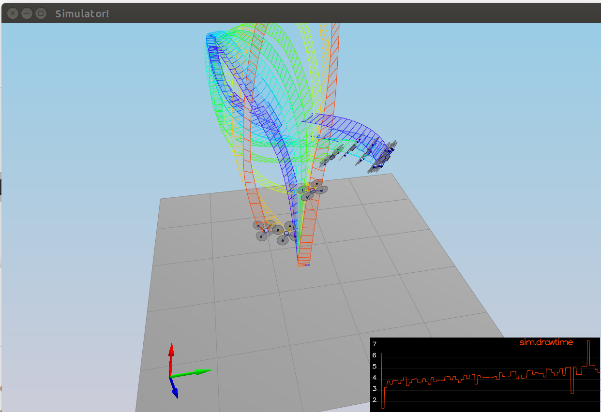
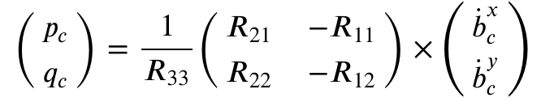

## Project: Control of a 3D Quadrotor
### Marko Sarkanj


---


### Writeup / README

This writeup contains the description of implementation of the Control of a 3D Quadrotor project. This project has been completed as part of the Self Flying Car Nanodegree program from Udacity.

### Code Implementation

#### 1. Implementation of body rate control in C++

The body rate controller receives commanded body rates and current body rates as input. The result of subtracting current body rates from commanded body rates is rate error that serves as input in calculating commanded 3-axis moment. 

Other two inputs for calculating commanded 3-axis moment are gain parameter and moments of inertia. Both of those inputs are configured in `QuadControlParams.txt` file as parameters.

The commanded 3-axis moment is calculated by multiplying moments of inertia, gain parameter and body rates error. 

```cpp
  V3F momentOfInertia;

  momentOfInertia.x = Ixx;
  momentOfInertia.y = Iyy;
  momentOfInertia.z = Izz;

  V3F rateError = pqrCmd - pqr;
  momentCmd = momentOfInertia * kpPQR * rateError;
```


#### 2. Implementation of roll pitch controller in C++

In the case that the collective trust of the controller is zero, the roll pitch controller returns roll and pitch rates 0. The reason for this is that there is no change in roll and pitch accelerations possible without thrust. Yaw rate is returned as zero because yaw is controlled by another controller separately.

The first value `cd`(acceleration) is calculated by dividing negative collective thrust in Newtons with the mass of the drone. This value is used to calculate `targetR13` and `targetR23` target rotation matrix values based on the desired x and y lateral accelerations. `targetR13` and `targetR23` values are then used to calculate `R13Err` and `R23Err` error rates between the target and the current values from the attitude rotation matrix. 

Commanded roll and pitch rates are then calculated by using  `R13Err`, `R23Err` error rates and `kpBank` roll/pitch gain with the help of following formula:



Source: Udacity lectures


```cpp
  if ( collThrustCmd > 0 ) {
    float cd = - collThrustCmd / mass;

    float targetR13 = CONSTRAIN(accelCmd.x / cd, -maxTiltAngle, maxTiltAngle);
    float R13Err = targetR13 - R(0,2);

    float targetR23 = CONSTRAIN(accelCmd.y / cd, -maxTiltAngle, maxTiltAngle);
    float R23Err = targetR23 - R(1,2);

    pqrCmd.x = 1 / R(2,2) * (R(1,0) * kpBank * R13Err - R(0,0) * kpBank * R23Err) ;
    pqrCmd.y = 1 / R(2,2) * (R(1,1) * kpBank * R13Err - R(0,1) * kpBank * R23Err);

  } else {
    pqrCmd.x = 0.0;
    pqrCmd.y = 0.0;
  }

  pqrCmd.z = 0;
```

#### 3. Implementation of altitude controller in C++

Input values of the altitude controller are the target altitude position and velocity as well as the current altitude position and velocity. Additional inputs are the time step of measurements as well as the feed-forward vertical acceleration. 

The controller is implemented as PDI controller(second order system) that takes the difference between the commanded and current altitude position. The output of the controller is thrust that is necessary to bring the drone to the desired altitude.

```cpp
  float P = kpPosZ * (posZCmd - posZ);
  float D = kpVelZ * (velZCmd - velZ) + velZ;
  integratedAltitudeError += (posZCmd - posZ) * dt;
  float I = KiPosZ * integratedAltitudeError;

  float u1Bar = P + D + I + accelZCmd;

  float accelerationCmd = ( u1Bar - CONST_GRAVITY ) / R(2,2);

  thrust = - mass * CONSTRAIN(accelerationCmd, - maxAscentRate / dt, maxAscentRate / dt);
```

#### 4. Implementation of lateral position control in C++

Input values for the lateral position controller are desired position, desired velocity, current position, current velocity and feed-forward acceleration. All of the input values are in the NED(north-east-down) coordinate system.

Output of the function are the commanded horizontal accelerations that serve as an input for the already described roll pitch controller.

To calculate the commanded horizontal accelerations, the position and the velocity gains gain parameters are first filled into V3F vector, to enable multiplication with the error rates in the same format.

As the next step, commanded velocity is limited to the maximal allowed XY velocity defined in the `QuadControlParams.txt` file as parameter.

To calculate acceleration increment the current position is subtracted from the commanded position and the result is multiplied by the `kpPosition` gain. Same step has been repeated for the velocity as well(with the `kpVelocity` gain) and the result of the position and the velocity increments have been added to the feed forward acceleration received as input.

The resulting commanded acceleration has been limited to the maximal allowed acceleration defined as parameter in the `QuadControlParams.txt` file.

```cpp
  V3F kpPosition;
  kpPosition.x = kpPosXY;
  kpPosition.y = kpPosXY;
  kpPosition.z = 0.f;

  V3F kpVelocity;
  kpVelocity.x = kpVelXY;
  kpVelocity.y = kpVelXY;
  kpVelocity.z = 0.f;

  if ( velCmd.mag() > maxSpeedXY ) {
    velCmd = velCmd.norm() * maxSpeedXY;
  }

  accelCmd = kpPosition * ( posCmd - pos ) + kpVelocity * ( velCmd - vel ) + accelCmd;

  if ( accelCmd.mag() > maxAccelXY ) {
    accelCmd = accelCmd.norm() * maxAccelXY;
  }
```

#### 5. Implementation of yaw control in C++

Implementing the yaw controller follows the same pattern as for the other previously described controllers. First it is constrained how high commanded yaw can be(it doesn't make sense to turn the drone more then 360 degrees). Then the current yaw angle is subtracted from the commanded yaw angle.  

In case that the yaw error is higher than one `pi`(3.14...) the yaw error is modified to rotate the drone to the other side by subtracting or adding value of 2 `pi`. This makes the drone more time and energy efficient to achieve the specific yaw position.

Lastly the yaw command rate is calculated by multiplying the yaw gain parameter(`kpYaw`) with the yaw error rate.

```cpp
  float constrYawCmd = CONSTRAIN(yawCmd, -2 * F_PI, 2 * F_PI);

  float yawError = constrYawCmd - yaw;

  if ( yawError > F_PI ) {
    yawError = yawError - 2 * F_PI;
  } if ( yawError < -F_PI ) {
    yawError = yawError + 2 * F_PI;
  }

  yawRateCmd = kpYaw * yawError;
```

#### 6. Calculating the motor commands given commanded thrust and moments in C++

To generate the commanded thrust for each propeller it is necessary first to convert commanded moments around specific axis into forces. That is achieved by dividing commanded moment with the propeller distance to the center of mass of the drone.

Once Fx, Fy and Fz values have been calculated it is possible to derive the trusts of the specific propellers by adding or subtracting force based on the propellers position.

In addition to the forces needed for the rotation, the collective thrust is added to the commanded thrust to keep the drone on the desired altitude. Collective trust is of course input from the altitude controller.

```cpp
    float l = L / sqrtf(2.f);

    float Fx = momentCmd.x / l;
    float Fy = momentCmd.y / l;
    float Fz = - momentCmd.z / kappa;

    cmd.desiredThrustsN[0] = (Fx + Fy + Fz + collThrustCmd)/4.f;
    cmd.desiredThrustsN[1] = (-Fx + Fy - Fz + collThrustCmd)/4.f;
    cmd.desiredThrustsN[2] = (Fx - Fy - Fz + collThrustCmd)/4.f ;
    cmd.desiredThrustsN[3] = (-Fx - Fy + Fz + collThrustCmd)/4.f;
```